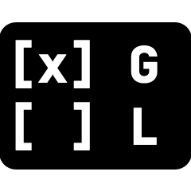
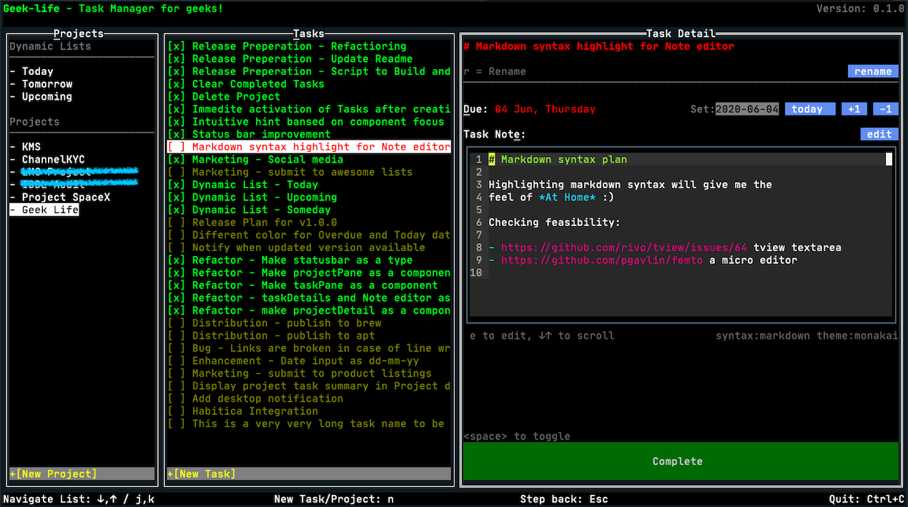

<h1>  

The CLI To-Do List / Task Manager for Geeks 
</h1>

<a href="https://www.producthunt.com/posts/geek-life?utm_source=badge-featured&utm_medium=badge&utm_souce=badge-geek-life" target="_blank"></a>
[](https://opensource.org/licenses/MIT)
[](https://goreportcard.com/report/github.com/ajaxray/geek-life)

:technologist: Developer / DevOps / Sysadmin? A command line hero?     
:computer: Live with the dark terminal?  
:memo: Think in Markdown?  

**Finally!** A full featured task manager for YOU! 


<a href="https://raw.githubusercontent.com/ajaxray/geek-life/master/screens/geek-life_v1.gif" target="_blank">Click to see it moving (GIF)
</a>
 


### :crystal_ball: Highlights

- For ninjas - do things faster with keyboard shortcuts
- Markdown lovers, feel at :house:! You'll see markdown everywhere.
- Full featured (almost) - Projects, Tasks, due-dates, task notes...
- A <4MB app that takes <1% CPU and ~7MB memory <sup>1</sup> - how much lighter you can think?
- Task note editor with markdown syntax highlighting<sup>2</sup>
- Full mouse support

### :dart: Roadmap
- [x] Create Project
- [x] Delete Project
- [ ] Edit Project
- [x] Create Task (under project)
- [x] Set Task due date (as `yyyy-mm-dd`) with shortcut
- [x] Set Task due date with quick input buttons (today, +1 day, -1 day)
- [x] Tasklist items should indicate status (done, pending, overdue) using colors 
- [x] Shortcut for Adding new Project and Task
- [x] Global shortcuts for jumping to Projects or Tasks panel anytime
- [x] Cleanup all completed tasks of project
- [x] Task note editor should syntax highlight (markdown) and line numbers  
- [x] Status bar for common shortcuts
- [x] Status bar should display success/error message of actions
- [x] Status bar may display quick tips based on focused element
- [ ] Dynamic lists 
    - Today - Due Today and overdue 
    - Upcoming - Due in one week
    - Someday - No due date
- [ ] [Havitica](https://habitica.com/)<sup>3</sup> integration - Use it as Habitica client or use Habitica for cloud backup
- [ ] Time tracking

### :rocket: Ready for action (installing and running)

It's just a single binary file, **no external dependencies**. 
Just download the appropriate version of [executable from latest release](https://github.com/ajaxray/geek-life/releases) for your OS. 
Then rename and give it permission to execute.   
For example:
```bash
mv geek-life_linux-amd64 geek-life  
sudo chmod +x geek-life
./geek-life
```

I recommend installing it globally (to run from any directory of your system). It's easy, just put it in your systems $PATH directory.
```bash
sudo mv geek-life /usr/local/bin/geek-life
geek-life
```

Done! *Manage your tasks your way!* 

## :keyboard: Keyboard shortcuts

Shortcut key for a pane/element will be marked with underline.

Some shortcuts are global, some are contextual. 
Contextual shortcuts will be applied according to focused pane/element.  
You'll see a currently focused pane bordered with double line. 
 

In case writing in a text input (e,g, new project/task, due date), you have to `Enter` to submit/save. 

| Context | Shortcut | Action |
|---|:---:|---|
| Global | `p` | Go to Project list |
| Global | `t` | Go to Task list |
| Projects | `n` | New Project |
| Tasks | `n` | New Task |
| Tasks | `Esc` | Go back to Projects Pane |
| Task Detail | `Esc` | Go back to Tasks Pane |
| Task Detail | `Space` | Toggle task as done/pending |
| Task Detail | `d` | Set Due date |
| Task Detail | `↓`/`↑` | Scroll Up/Down the note editor |
| Task Detail | `e` | Activate note editor for modification |
| Active Note Editor | `Esc` | Deactivate note editor and save content |

**Tips about using shortcuts efficiently:**  

- `Esc` will bring you a step back - to previous pane in most cases.
- When you're in Project or Task list, use `↓`/`↑` to navigate the list.
- When you're in Project or Task list `Enter` will load currently selected Project/Task.
- After creating new Project, focus will automatically move to Tasks. Start adding tasks immediately by pressing `n`.   
- After creating new Task, focus will stay in "new task" input. So that you can add tasks quickly one after another. 
- After creating new Task, Press `Esc` when you're done creating tasks. 

## :hammer_and_wrench: Building blocks

- Made with :heart: and [golang](https://golang.org/) 1.14 *(you don't need golang to run it)*
- Designed with [tview](https://github.com/rivo/tview) - interactive widgets for terminal-based UI
- Task Note editor made with [femto](https://github.com/pgavlin/femto)  
- Datastore is [storm](https://github.com/asdine/storm) - a powerful toolkit for [BoltDB](https://github.com/etcd-io/bbolt)

### Contribute

If you fix a bug or want to add/improve a feature, 
and it's aligned with the focus (merging with ease) of this app, 
I will be glad to accept your PR. :) 

## :bulb: You may ask...

#### :question: Where is the data stored? Can I change the location?

By default, it will try to create a db file in you home directory. 

But as a geek, you may try to put it different location (e,g, in your dropbox for syncing).
In that case, just mention `DB_FILE` as an environment variable.
 
```bash
DB_FILE=~/dropbox/geek-life/default.db geek-life
```

#### :question: How can I suggest a feature?

Just [post an issue](https://github.com/ajaxray/geek-life/issues/new) describing your desired feature/enhancement 
and select `feature` label.

Also, incomplete features in the current roadmap will be found in issue list. 
You may :thumbsup: issues if you want to increase priority of a feature.

---
### Footnotes 
1. In my Macbook Air, 1.6 GHz Dual-Core Intel Core i5, RAM: 8 GB 1600 MHz DDR3
2. Using [monakai](https://github.com/sickill/vim-monokai) color scheme for markdown syntax
3. Habitica is a free habit and productivity app that treats your real life like a game

---
> "This is the Book about which there is no doubt, a guidance for those conscious of Allah" - [Al-Quran](http://quran.com)
